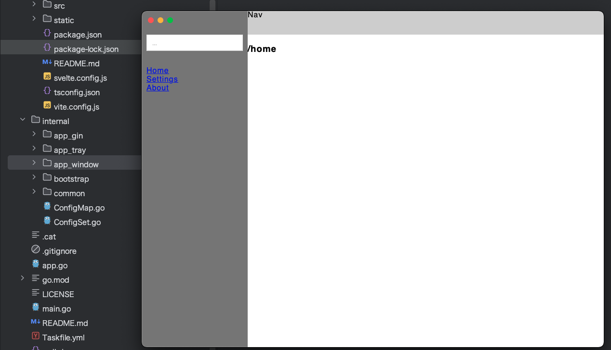

### Waigo是用Golang+Web写的“视图窗口+稳定服务”的桌面端多功能程序基建。
```text
Waigo基于Wails3、Ginvel3等。ApacheV2 License。

前端默认Svelte5。

（方+——爬说明，仅在Git——-h>ub发布，20251205）

开源地址：https://github.com/fyonecon/Waigo 。

```

### 老一辈艺术家坚持手搓：

Python版基座请戳：https://github.com/fyonecon/Ginthon 。

Golang版基座请戳：https://github.com/fyonecon/Waigo 。

Go和PY都是以“尽量返回默认值来代替‘抛出Err’”+“尽量复用函数”+“尽量不使用继承”为原则。

---

### 程序要求：
```
需要 go1.25+

需要 webview2或webkit基础环境

已适配macOS12+、Win10+。Linux环境尚未验证。

开发IDE Goland、VSCode。

```

### 拉取项目：
> git clone -b main https://github.com/fyonecon/Waigo.git Waigo-Main

### 运行项目:
⚠️由于项目引入了Skeleton UI，运行npm或pnpm时，需要在/frontend/目录执行“npx sv add tailwindcss”来自动配置 Tailwind CSS 和相关的依赖：

(参考：https://www.skeleton.dev/docs/svelte/get-started/installation/sveltekit )
> 
> npx sv add tailwindcss
>

下面命令已经内置包含npm install、go mod tidy。
>
> wails3 dev
>


### 打包成桌面可运行程序包：
请参考：https://v3alpha.wails.io/guides/build/building/ 。

推荐真机打包对应软件架构版本，因为一些依赖在各个平台下运行不一致。

打包后的软件在”/Waigo/bin“目录。

macOS平台：
>
> wails3 build GOOS=darwin GOARCH=amd64
>
> wails3 build GOOS=darwin GOARCH=arm64

Windows平台：
>
> wails3 build GOOS=windows GOARCH=amd64
>
> wails3 build GOOS=windows GOARCH=arm64

Linux平台：
>
> wails3 build GOOS=linux GOARCH=amd64
>
> wails3 build GOOS=linux GOARCH=arm64
>

### 官方文档：
（⚠️注意wails3的文档和实际代码区别较大，效果以实际代码为准。）
> wails：https://v3alpha.wails.io/quick-start/installation/
>
> gin：https://gin-gonic.com/zh-cn/docs/
>
> Skeleton UI：https://www.skeleton.dev/docs/svelte/guides/mode
>
> Tailwind CSS：https://www.tailwindcss.cn/docs/installation
>
> Iconify SVG：https://icon-sets.iconify.design/

### 项目结构：
```text
Waigo-Main
├── build 配置Mac、Win、Linux环境的软件图标、名称、版本、打包信息等
├── frontend 视图UI，默认SvelteKit
│   ├── src 视图发开发文件
│   │   └── common 公共函数
│   │   └── pages 页面具体实现
│   │   └── parts 公用Svelte组件
│   │   └── stores 绑定数据管理
│   │   └── routes 路由、layout、公共参数验证
│   ├── config.js 配置文件
│   ├── static 静态文件、图标
├── ginassets 额外的web资源、视图。默认端口9850，外部浏览器可访问
│   ├── files 放文件
│   │   └── test.txt
│   ├── html 放HTML文件或文件
│   │   ├── favicon.ico
│   │   └── index.html
├── go.mod
├── go.sum
├── internal 框架逻辑
│   ├── app 自定义程序
│   │   ├── app_gin 服务：Gin
│   │   │   ├── gin_controller
│   │   │   │   ├── Files.go
│   │   │   │   └── init.go 空间命名的Struct
│   │   │   ├── init.go 空间命名的Struct
│   │   │   ├── Middlewares.go
│   │   │   ├── RouteAPI.go
│   │   │   ├── RouteFile.go
│   │   │   └── RouteHTML.go
│   │   ├── app_services 服务：定时器等
│   │   │   ├── init.go 空间命名的Struct
│   │   │   └── TimeInterval.go
│   │   ├── app_tray 服务：状态栏托盘
│   │   │   ├── init.go 空间命名的Struct
│   │   │   └── Tray.go
│   │   ├── app_window 服务：Wails主视图相关
│   │   │   ├── init.go 空间命名的Struct
│   │   │   ├── window_controller
│   │   │   │   ├── GoRunJS.go Go调用JS
│   │   │   │   ├── init.go 空间命名的Struct
│   │   │   │   └── JSCallGo.go JS调用GO
│   │   │   └── Window.go
│   ├── bootstrap 框架逻辑的实现（服务启动）
│   │   ├── app_gin.go
│   │   ├── app_tray.go
│   │   ├── init_check_sys.go 运行系统环境检测
│   │   └── init_window.go
│   ├── common 公用函数、封装的kit
│   │   ├── Func.go 公用函数
│   │   ├── kits 封装的各种kit
│   │   │   ├── _7Z.go
│   │   │   ├── CacheData.go 软件启动后的自定义参数数据，关闭软件后消失
│   │   │   ├── ExecDarwin.go 自动在Mac环境下编译
│   │   │   ├── ExecWindows.go 自动在Win环境下编译
│   │   │   ├── FileContentTypeDict.go 文件格式对照表
│   │   │   ├── ICON.go 二进制图标
│   │   │   ├── IconData.go 二进制图标
│   │   │   └── Secret.go 对称加密
│   │   └── Language.go
│   ├── ConfigMap.go 配置文件：读
│   └── ConfigSetter.go 配置文件：读、写
├── LICENSE
├── main.go
├── README.md
├── show.png
└── Taskfile.yml Wails官方的命令行任务

```

### 运行效果：


---

### Golang环境搭建:
```text
Go下载：https://golang.google.cn/dl/

Node下载：https://nodejs.org/en/download

Git下载：https://git-scm.com/install/mac

开发工具（IDE）：VSCode、Goland
```

开启mod模式:
> go env -w GO111MODULE=on

go get大陆地区代理：

> go env -w GOPROXY=https://goproxy.cn,https://goproxy.io,direct

### Wails3新项目搭建:
0.安装wails3:
> go install github.com/wailsapp/wails/v3/cmd/wails3@latest
> 
> wails3 doctor

1.查看支持哪些前端框架：
> wails3 init -l

2.初始化一个新项目Waigo，前端框架使用sveltekit：
> wails3 init -n Waigo -t sveltekit

3.运行：
> wails3 dev

### 针对Mac中.app文件打开时显示“软件已损坏”问题
```
1.1 在Mac的终端输入命令行：sudo spctl --master-disable
1.2 然后输入你的Mac锁屏密码，回车确认。
1.3 打开设置----隐私与安全----安全----勾选“任何来源”。
2. 安装xxx.app软件到Mac的应用文件夹里。
3.1 在Mac终端输入命令行：sudo xattr -r -d com.apple.quarantine /Applications/xxx.app
3.2 然后输入你的Mac锁屏密码，回车确认。
4. OK了。
```


### 2025-12-05